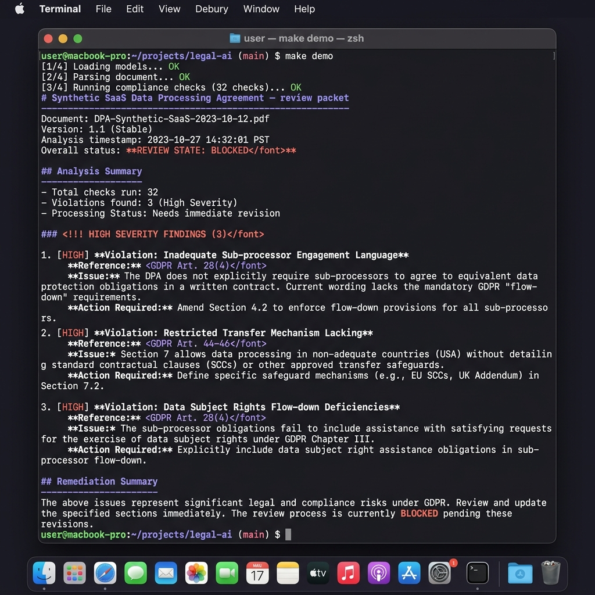

# dpa-and-data-transfer-review

[](https://github.com/sebastianfoerste/dpa-and-data-transfer-review/actions/workflows/ci.yml)

Deterministic, cited GDPR Art. 28 + Chapter V transfer checks; produces a review packet with a visible review state and a gating exit code. Not legal advice; data is synthetic.

**Public-safety posture:** synthetic DPA facts only, cited source provenance, visible review state, a lawyer review gate, and no legal advice.

> **If you don't code:** scroll to [What the demo produces](#what-the-demo-produces). The repository ships a sample output you can read in the browser: a cited checklist with a clear review state. The point is not the code; it is whether the legal review is structured, cited, reviewable, and testable.



## Why this exists

Vendor and DPA review is high-volume, repetitive, and easy to do inconsistently. Every miss, a sub-processor in a third country with no transfer mechanism, no flow-down of obligations, or a missing breach-notification clause, is a real exposure. This encodes the recurring GDPR Article 28 and Chapter V checks as deterministic rules with citations, so the boring 80% is consistent and a lawyer's time goes to the judgement calls.

The thesis is the same one that runs through my other repositories: **legal AI and legal automation quality should be measured and reviewable, not asserted.**

## Run it

```bash
git clone https://github.com/sebastianfoerste/dpa-and-data-transfer-review
cd dpa-and-data-transfer-review
make install   # no third-party dependencies, standard library only
make test      # deterministic unit tests
make demo      # writes examples/review-packet.md and .json, prints the packet
```

`make demo` runs end to end, offline and deterministically, against the synthetic DPA in `data/sample_dpa.json`.

## What the demo produces

The sample DPA contains three deliberately planted defects. The tool catches all three, marks them `HIGH`, and **blocks** the packet (exit code `2`):

```
# Synthetic SaaS Data Processing Agreement review packet

**Review state: BLOCKED**

> BLOCKED: open high-severity findings must be resolved before this DPA can be relied on.

Checks: 20, present 17, missing 3, needs-review 0, open high 3, open medium 0

## Open findings

| Severity | Status | Finding | Citation | Remediation |
| --- | --- | --- | --- | --- |
| HIGH | [missing] | Sub-processor flow-down of data-protection obligations | GDPR Art. 28(4) | Add a clause imposing materially equivalent obligations on every sub-processor (Art. 28(4)). |
| HIGH | [missing] | Sub-processor transfer: Support Tools LLC (US) | GDPR Art. 28(4) / Art. 44-46 | Confirm the transfer mechanism covering Support Tools LLC in US. |
| HIGH | [missing] | International transfer to US | GDPR Art. 44-46 | Document a valid Art. 46 safeguard for US (or an Art. 49 derogation) and record the basis. |
```

The full packet (cleared items included) is committed at [`examples/review-packet.md`](examples/review-packet.md) and [`examples/review-packet.json`](examples/review-packet.json) so you can read a real output without running anything.

Fix the three defects in the input (flow-down clause, an Art. 46 mechanism for the US transfer, and a recorded transfer impact assessment) and the packet drops to `NEEDS_REVIEW`. There is a test that asserts exactly this transition.

## AI SaaS GC use case

A first legal hire or General Counsel at an AI SaaS company can use this as a privacy proof surface before signature:

1. **DPA defects:** the sample packet catches missing sub-processor flow-down, missing transfer mechanism, and missing transfer impact evidence.
2. **Transfer mechanism:** the review distinguishes adequacy, Art. 46 safeguards, and Art. 49 derogations per destination and sub-processor.
3. **Transfer impact evidence:** the packet stays blocked until transfer impact assessment evidence is recorded where needed.
4. **Blocked state:** high-severity findings produce `BLOCKED` and exit code `2`, so the review can stop a workflow rather than merely warn.
5. **Lawyer review:** even a remediated packet moves to review, not autonomous approval.

## What it checks

| Area | Citation | What the rule looks for |
| --- | --- | --- |
| Mandatory processor clauses | GDPR Art. 28(3)(a)-(h) | Documented instructions, confidentiality, security, assistance, deletion/return, audit rights |
| Processing description | GDPR Art. 28(3) | Subject matter, duration, nature/purpose, categories of data |
| Sub-processor authorisation | GDPR Art. 28(2) | Specific or general written authorisation |
| Sub-processor flow-down | GDPR Art. 28(4) | Equivalent obligations imposed on sub-processors |
| Breach notification | GDPR Art. 33(2) | Processor-to-controller notice, "without undue delay" |
| International transfers | GDPR Art. 44-46 | EEA vs adequacy (Art. 45) vs SCCs/BCR (Art. 46) vs Art. 49 derogations, per destination **and** per sub-processor |
| Transfer impact assessment | GDPR Art. 46 (CJEU C-311/18) | Recorded TIA where Art. 46 safeguards are relied on |
| US service-provider terms | CCPA §1798.140(ag) / CPRA | Service-provider restrictions where US personal information is in scope |

Reference data (EEA members, adequacy countries, valid mechanisms) is explicit and citeable in [`src/dpa_review/checks.py`](src/dpa_review/checks.py); it is illustrative and should be verified against the current Commission decisions in real use.

## How it is built

- **Deterministic.** Same input, same packet, every time. There is a test for it. No model calls, no network.
- **Cited.** Every finding carries a GDPR/CCPA citation; nothing is asserted without a reference.
- **Reviewable.** Output is a packet with an explicit state and a remediation column, designed to hand to a lawyer, never to replace one.
- **Gating.** `BLOCKED` -> exit `2`, `NEEDS_REVIEW` -> exit `1`, `CLEARED_FOR_REVIEW` -> exit `0`, so it can sit in a pipeline.

```
src/dpa_review/
  checks.py   # the rules: each maps a feature of the DPA to a citation + severity
  review.py   # engine: runs the rules, decides the review state, renders the packet
  cli.py      # python -m dpa_review.cli --input data/sample_dpa.json --out examples
data/sample_dpa.json     # synthetic DPA with three planted defects
examples/                # committed sample output (md + json)
tests/test_review.py     # deterministic tests, standard-library unittest
```

## Scope and disclaimers

This is a **first-pass triage** tool over a structured representation of a DPA. It does not read free-text contracts, does not give legal advice, and does not establish a lawyer-client relationship. It is designed to make a lawyer faster, not to remove the lawyer. Every bundled example is synthetic; there is no client data, privileged material, or personal data in this repository.

## License

MIT. See [`LICENSE`](LICENSE).

## Human-authored legal judgment
AI tools assisted the implementation, but the parts that carry the value are
human-authored: the GDPR Article 28/Chapter V checks, the adequacy reference data, and
the review-state thresholds. The point of this repository is not code volume; it is showing
how legal judgment can be made structured, testable, and reviewable.

## Business use case
A scaling AI SaaS company receives recurring vendor, customer, and sub-processor
reviews. The questions repeat, but the risk is not zero. This shows how first-pass
privacy review becomes structured, cited, and reviewable while preserving escalation,
source visibility, and human judgment.

## Known limitations
A public-safe prototype, not legal advice.
1. Operates over a structured representation of a DPA, not free-text contracts.
2. The adequacy/transfer reference data is illustrative. Verify against current
   European Commission decisions before any real use.
3. One jurisdiction lens (GDPR + a CCPA secondary check).
4. No integration with a real CLM or ticketing system.
Next production step: free-text ingestion, current adequacy data as a maintained
source, and CLM integration.
