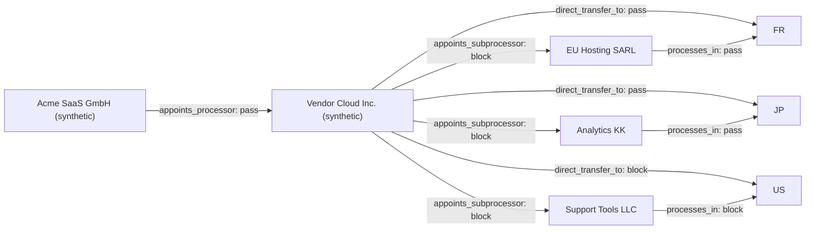

# DPA Transfer Chain Evidence Graph

**Graph status: BLOCKED**

- Review packet state: `BLOCKED`
- Blocked edges: 5
- Review edges: 0
- Graph SHA-256: `e2954b2184c0bad1ddb79a8173574fe54451963c18e8bfc7df7f25f37afbf3a9`
- External actions: disabled

## Transfer chain

## Weakest links

| Edge | Status | Relationship | Controls |
| --- | --- | --- | --- |
| processor-direct-to-us | block | direct_transfer_to | transfer.us |
| processor-to-subprocessor-1 | block | appoints_subprocessor | subprocessor.authorization, subprocessor.flowdown |
| processor-to-subprocessor-2 | block | appoints_subprocessor | subprocessor.authorization, subprocessor.flowdown, transfer.subprocessor.support_tools_llc |
| processor-to-subprocessor-3 | block | appoints_subprocessor | subprocessor.authorization, subprocessor.flowdown, transfer.subprocessor.analytics_kk |
| subprocessor-2-to-us | block | processes_in | transfer.subprocessor.support_tools_llc |

## Control remediation queue

| Control | Severity | Affected edges | Reviewer | Required evidence |
| --- | --- | ---: | --- | --- |
| subprocessor.flowdown | HIGH | 3 | Privacy Counsel | Add a clause imposing materially equivalent obligations on every sub-processor (Art. 28(4)). |
| transfer.subprocessor.support_tools_llc | HIGH | 2 | Privacy Counsel | Confirm the transfer mechanism covering Support Tools LLC in US. |
| transfer.us | HIGH | 1 | Privacy Counsel | Document a valid Art. 46 safeguard for US (or an Art. 49 derogation) and record the basis. |

## Review gate

The graph is a deterministic reviewer aid. It does not validate a transfer mechanism, approve a sub-processor, or execute a transfer.
