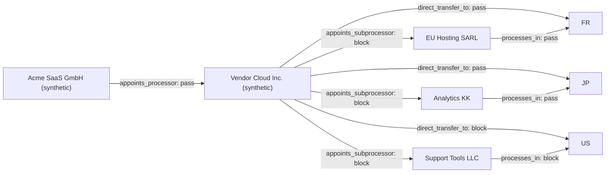

# DPA Transfer Chain Evidence Graph

**Graph status: BLOCKED**

- Review packet state: `BLOCKED`
- Blocked edges: 5
- Review edges: 0
- Graph SHA-256: `2c4ef634809a7a7ae3b59a3c38ecda65667007b8092ef13013c55d36eaec8202`
- External actions: disabled

## Transfer chain

## Weakest links

| Edge | Status | Relationship | Controls |
| --- | --- | --- | --- |
| processor-direct-to-us | block | direct_transfer_to | transfer.us |
| processor-to-subprocessor-1 | block | appoints_subprocessor | subprocessor.authorization, subprocessor.flowdown |
| processor-to-subprocessor-2 | block | appoints_subprocessor | subprocessor.authorization, subprocessor.flowdown, transfer.subprocessor.support_tools_llc |
| processor-to-subprocessor-3 | block | appoints_subprocessor | subprocessor.authorization, subprocessor.flowdown, transfer.subprocessor.analytics_kk |
| subprocessor-2-to-us | block | processes_in | transfer.subprocessor.support_tools_llc |

## Review gate

The graph is a deterministic reviewer aid. It does not validate a transfer mechanism, approve a sub-processor, or execute a transfer.
